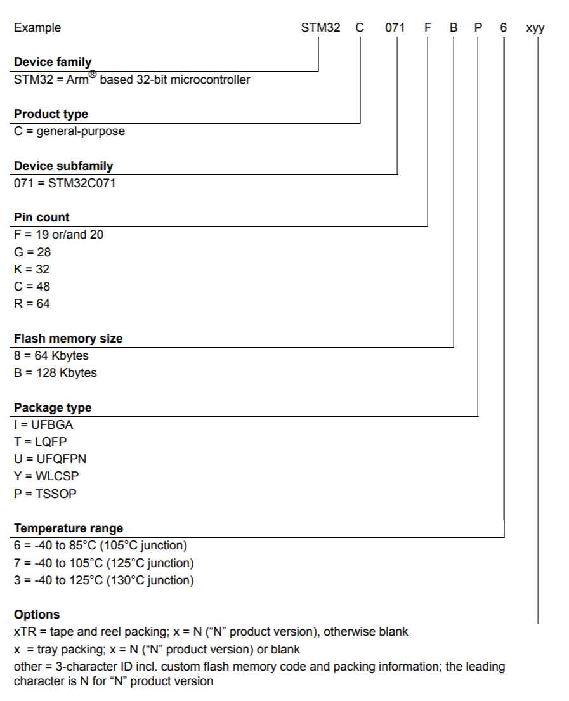
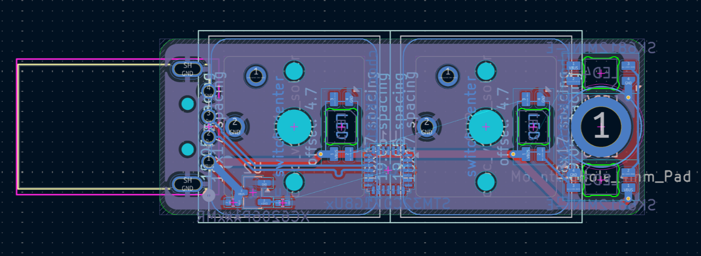

## August 19th: let's get started! (1 hour)

The plan for this is to have a rp2040 with two keyswitches and a male USB-A plug. I also want to have some RGB LEDs, maybe reverse mounted under the keyswitches.

## August 22nd: supporting rp2040 electronics. (45 minutes)

I got all of the necessary circuitry for the rp2040 added. I'm following the design guide exactly, except for the voltage regulator. I'm using a different one because it's on JLCPCB's basic parts list so I don't have to pay a reeling fee.

## August 24th: Packaging is *hard* (2 hours 15 minutes)

I started working on the PCB layout. I want to have two Kailh Choc switches, both with reverse mounted SK6812MINI-E addressable LEDs. First, I got the switches and LEDs put into position. However, once I started trying to cram the rp2040 and the flash chip things got annoying. I spent a lot of time trying different ways of fitting them, but I couldn't get them to work with the PCB size that I had chosen. I don't really want to make the PCB much bigger, so I might have to switch MCUs to something that's physically smaller. On a positive note, I was able to get 3d models for *both* the switches and the keycaps!

## August 30th: Switching to the STM32 (3 hours)

I spent a bit more time trying to get everything to fit with the rp2040, but it just wasn't gonna work. I decided to switch to the STM32, which supports USB HID and is physically very small. One thing I liked about it's datasheet is this diagram showing the exact part number combos:

I also changed the 3v3 regulator to smaller one, cuz the one the rp2040 design guide recommends was much too big. The STM32 is quite easy to wire up, which I liked. I also got to power and some of the other routing done:

## September 3rd: 80/20, 20/80 (2 hours 30 minutes)

The first 80% takes 20% of the effort, and the last 20% takes 80%. Maybe not that extreme, but pretty close. I ran the DRC and discovered that there were quite a few issues, including overlapping components. Additionally, I remembered to add a level shifter for the LED data line. I also had to source parts for everything. Around half of the parts are being assembled by JLCPCB. The rest include the Sk6812MINI-Es, the USB-A plug, the Kailh switches, and the keycaps (obviously JLC isn't soldering on the keycaps). I'm getting the LEDs, the keycaps, and the switches from [Keebs.io](https://keebs.io). I'm getting the USB-A plug from Digikey, and I'm also getting a SWD programmer from Waveshare.
