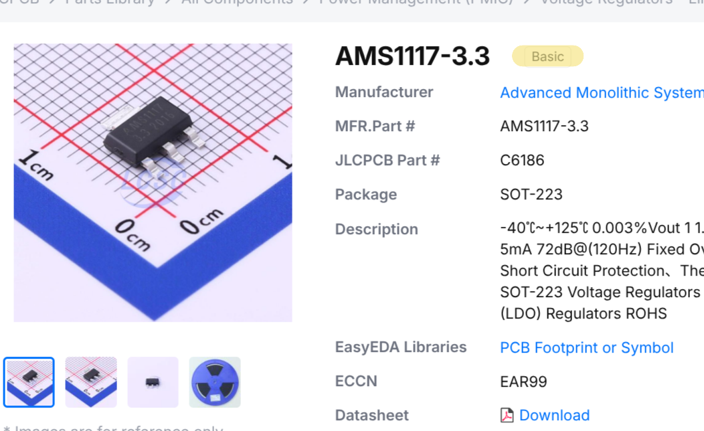
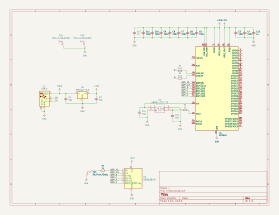
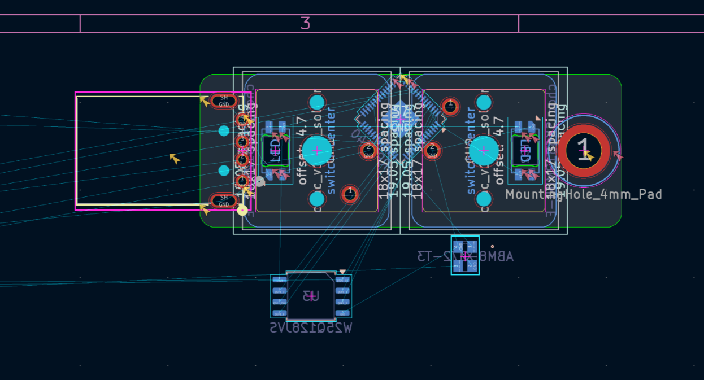
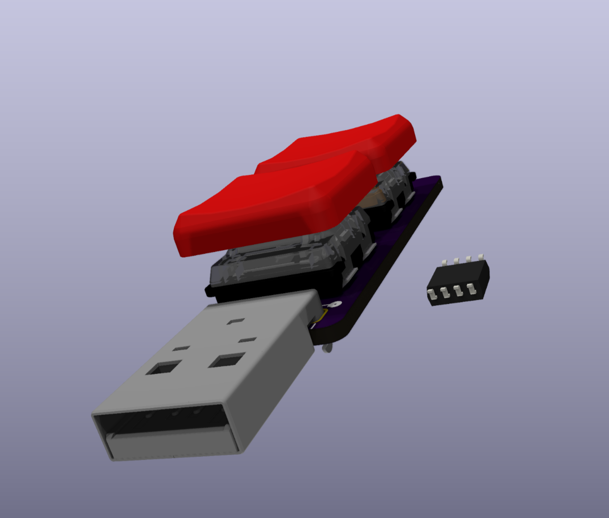

## August 19th: let's get started! (1 hour)

The plan for this is to have a rp2040 with two keyswitches and a male USB-A plug. I also want to have some RGB LEDs, maybe reverse mounted under the keyswitches.

## August 22nd: supporting rp2040 electronics. (45 minutes)

I got all of the necessary circuitry for the rp2040 added. I'm following the design guide exactly, except for the voltage regulator. I'm using a different one because it's on JLCPCB's basic parts list so I don't have to pay a reeling fee.

## August 24th: Packaging is *hard* (2 hours 15 minutes)

I started working on the PCB layout. I want to have two Kailh Choc switches, both with reverse mounted SK6812MINI-E addressable LEDs. First, I got the switches and LEDs put into position. However, once I started trying to cram the rp2040 and the flash chip things got annoying. I spent a lot of time trying different ways of fitting them, but I couldn't get them to work with the PCB size that I had chosen. I don't really want to make the PCB much bigger, so I might have to switch MCUs to something that's physically smaller. On a positive note, I was able to get 3d models for *both* the switches and the keycaps!

