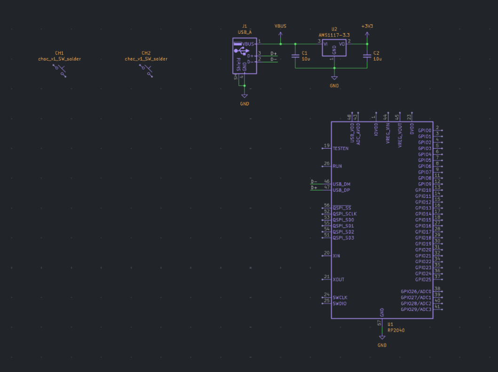

## August 19th: let's get started! (1 hour)

The plan for this is to have a rp2040 with two keyswitches and a male USB-A plug. I also want to have some RGB LEDs, maybe reverse mounted under the keyswitches.

