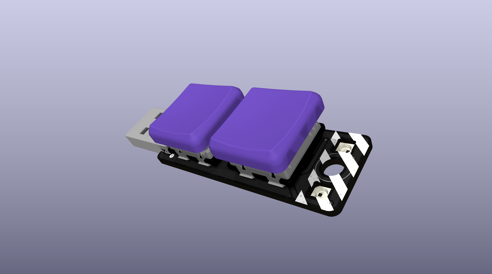
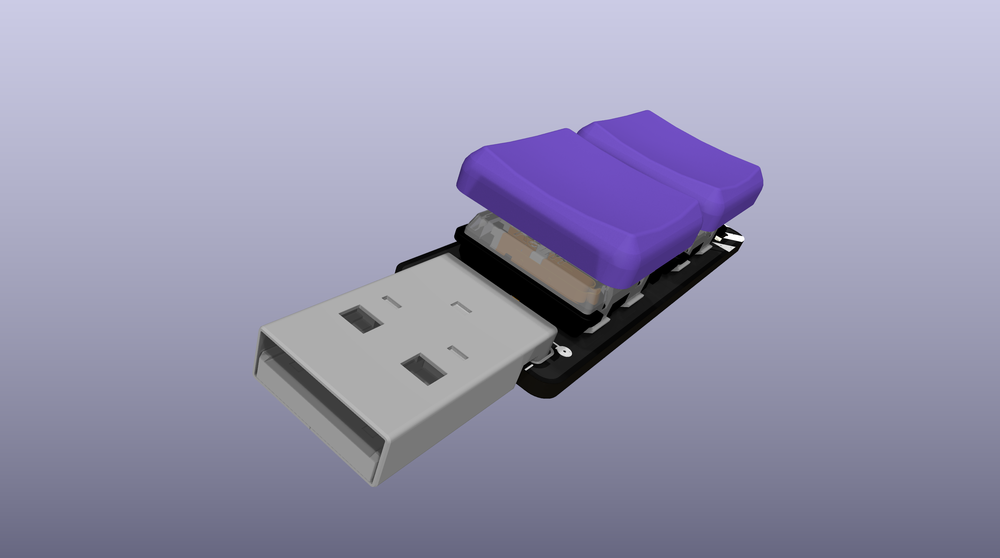
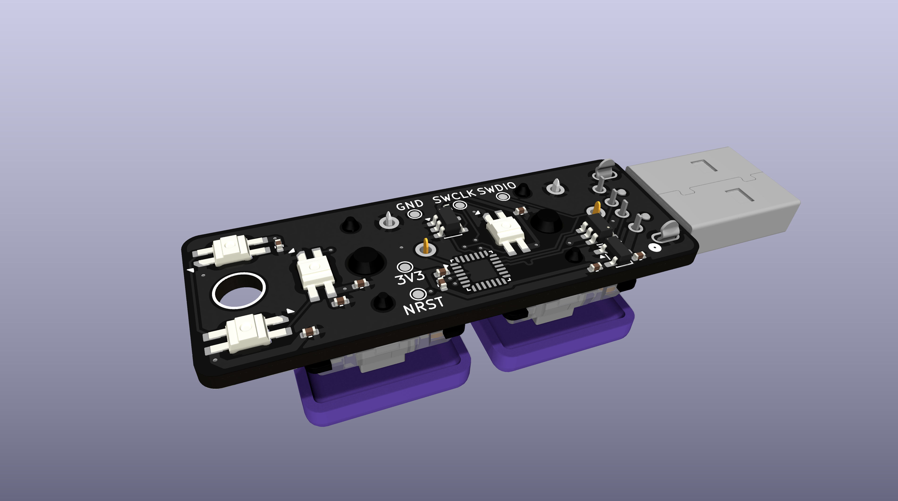

# Trinkey

Trinkey is a STM32 based keychain trinket. It has two Kailh switches, each with  a MBK low profile keycap and a reverse mounted SK6812MINI-E RGB LED. Additionally, there are two more reverse mounted SK6812MINI-E next to the keyring. It also has a male USB-A plug which powers the device and provides USB FS connectivity. 

## Flashing Software

The Trinkey has pads for flashing using **S**erial **W**ire **D**ebug. If you're getting one of these thru [Hack Club Gadget Market](https://gadget.hackclub.com), it will be pre flashing with a bootloader that supports uploading code over USB using the Ardunio IDE. It will also have some sort of example program, but that is still TBD. I will also design a jig for holding contact against the test pads for flashing over SWD.

## Bill of Materials

| Item | Vendor | Price |
|------|--------|-------|
|PCB|JLCPCB|$70.43|
|[USB-A plug](https://www.digikey.com/en/products/detail/molex/0480370001/857603)|Digikey|$10.38|
|Shipping|Digikey|$4.99|
|Tariff|Digikey|$2.08|
|Sales tax|Digikey|$1.22|
|[SK6812MINI-E (25 pack)](https://keeb.io/products/sk-6812-mini-e-rgb-leds-12-pack)|Keebs.io|$5.99|
|[Kailh low profile switches](https://keeb.io/products/kailh-choc-low-profile-switches-v1)|Keebs.io|$7.20|
|[MBK PBT Blank keycaps](https://keeb.io/products/mbk-keycaps)|Keebs.io|$4.41|
|Shipping|Keebs.io|$7.90|
|[ST-LINK/V2 (mini)](https://www.waveshare.com/st-link-v2-mini-stm32.htm)|Waveshare|$8.99|
|Shipping|Waveshare|$10.00|
|**Total**| |**$133.59**|
